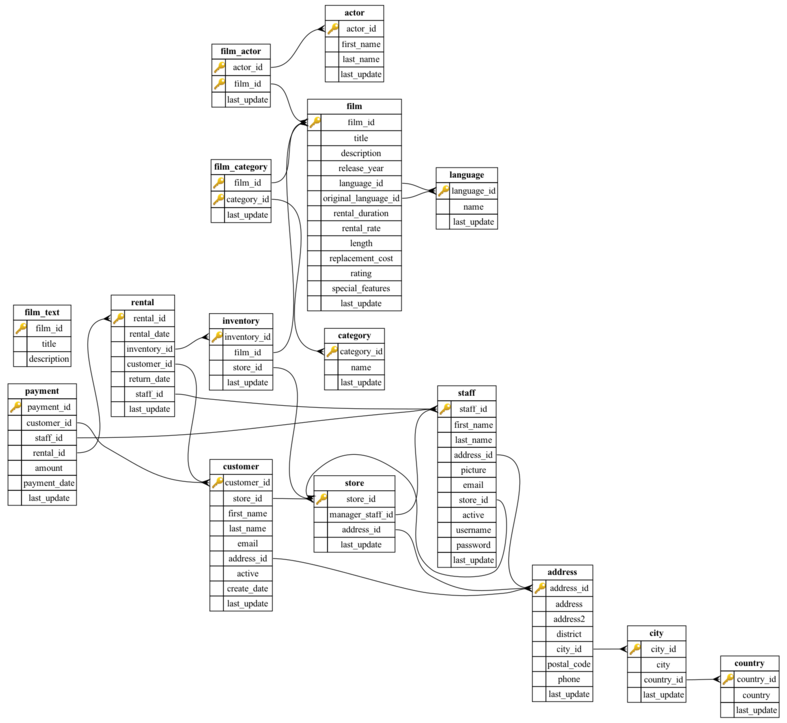

## LABORATORIUM 5



### Zadania

Proszę wziąć kartkę i ołówek (może też być długopis :-)
Proszę zapisać na kartce poniższe zapytania SQL.

#### Zadanie 1: Sortowanie według wielu kolumn (`ORDER BY`)

Wyświetl tytuł (`title`), czas trwania (`length`) oraz opłatę
za wypożyczenie (`rental_rate`) z tabeli `film` dla filmów, których
stawka wypożyczenia wynosi `2.99`. Wyniki posortuj malejąco według
czasu trwania filmu, a w przypadku takich samych długości – rosnąco
(alfabetycznie) według tytułu.

#### Zadanie 2: Sortowanie zagregowanych danych z warunkiem (`GROUP BY`, `HAVING`, `ORDER BY`)

Wyświetl imię (`first_name`) i nazwisko (`last_name`) klientów oraz
łączną liczbę dokonanych przez nich wypożyczeń (`COUNT(rental_id)`).
Uwzględnij tylko tych klientów, którzy wypożyczyli co najmniej
30 filmów. Posortuj wynik malejąco według liczby wypożyczeń,
a w przypadku takiej samej liczby wypożyczeń – rosnąco (alfabetycznie)
według nazwisk.

#### Zadanie 3: Wybranie pierwszych N rekordów (`ORDER BY` i `LIMIT`)

Znajdź 5 klientów, którzy wydali najwięcej pieniędzy na wypożyczenia.
Wyświetl ich imię (`first_name`), nazwisko (`last_name`) oraz sumę
dokonanych wpłat (`SUM(amount)`).

#### Zadanie 4: Stronicowanie wyników (`LIMIT` i `OFFSET`)

Wyobraź sobie, że tworzysz stronicowanie (paginację) dla katalogu
filmów na stronie internetowej, gdzie na jednej stronie wyświetla się
po 10 pozycji.

Pobierz **drugą stronę** wyników (czyli pozycje od 11 do 20) dla
zestawienia najdłuższych filmów z tabeli `film`.

Wyświetl:

* tytuł filmu (`title`),

* czas trwania (`length`).

Wyniki posortuj malejąco według czasu trwania, a przy jednakowej
długości – alfabetycznie według tytułu.

#### Zadanie 5: `LEFT OUTER JOIN`

Wyświetl tytuł (`title`) oraz identyfikator filmu (`film_id`) dla
wszystkich filmów z tabeli `film`, których brak w jakimkolwiek sklepie
(czyli nie mają żadnego przypisanego egzemplarza w tabeli
`inventory`). Użyj złączenia `LEFT JOIN` oraz weryfikacji braku
wartości `IS NULL`.

#### Zadanie 6: `FULL OUTER JOIN`

Porównaj listy osób z tabel `actor` oraz `customer`, dopasowując je
po identycznym imieniu (`first_name`) i nazwisku (`last_name`).
Wyświetl dane obu stron za pomocą `FULL OUTER JOIN`, aby otrzymać
pełne zestawienie obejmujące:

* osoby będące jednocześnie aktorami i klientami,
* aktorów, którzy nie są klientami,
* klientów, którzy nie są aktorami.

#### Zadanie 6: Wartość równa wynikowi podzapytania (`kolumna = (SELECT ...)`)

**Treść zadania:** Wyświetl tytuł (`title`) oraz czas trwania
(`length`) tych filmów z tabeli `film`, których długość jest dokładnie
równa maksymalnemu czasowi trwania filmu w całej bazie danych.

#### Zadanie 7: Wartość mniejsza od wyniku podzapytania (`kolumna < (SELECT ...)`)

Znajdź tytuły (`title`) i czas trwania (`length`) wszystkich filmów
z tabeli `film`, których czas trwania jest krótszy niż średni czas
trwania wszystkich filmów w tabeli.

#### Zadanie 8: Przynależność do zbioru (`kolumna IN (SELECT ...)`)

Pobierz imiona (`first_name`) oraz nazwiska (`last_name`) tych aktorów
z tabeli `actor`, którzy zagrali w filmie o tytule `'ACADEMY
DINOSAUR'`.

#### Zadanie 9: Wykluczenie ze zbioru (`kolumna NOT IN (SELECT ...)`)

Wyświetl tytuły (`title`) tych filmów z tabeli `film`, których
identyfikator (`film_id`) nie występuje w tabeli `inventory` (czyli
filmów, które nie mają ani jednego egzemplarza na stanie w żadnym
sklepie).

#### Zadanie 10: Test istnienia rekordu (`EXISTS (SELECT ...)`)

Wyświetl imię (`first_name`) i nazwisko (`last_name`) tych klientów
z tabeli `customer`, dla których w tabeli `payment` istnieje
przynajmniej jedna płatność o kwocie (`amount`) większej niż `11.00`.
Zacznij podzapytanie od `SELECT 1`.

#### Zadanie 11: Test braku istnienia rekordu (`NOT EXISTS (SELECT ...)`)

Wyświetl imiona (`first_name`) i nazwiska (`last_name`) tych aktorów
z tabeli `actor`, którzy nie wystąpili w ani jednym filmie o kategorii
wiekowej `'R'` (`rating = 'R'`). Zacznij podzapytanie od `SELECT 1`.

### Jak rozwiązywać zadania?

- Proszę uruchomić program `sqlite3` z argumentem `sakila.sqlite3`:
```bash
sqlite3 sakila.sqlite3
```

- Proszę przepisać z kartki zapytania SQL. Polecam nie używać klawisza
ENTER wewnątrz zapytań. Dzięki temu łatwiej będzie można je edytować,
używając klawisza "strzałka w górę". Proszę pamiętać o zakończeniu
każdego zapytania średnikiem `;`

- Jeśli jakieś zapytanie zakończy się błędem, proszę powoli
i dokładnie przeczytać komunikat o błędzie i przepisać to zapytanie
jeszcze raz. Można też użyć:

    - klawisza "strzałka w górę", aby powtórnie edytować poprzednią
      linię
    - klawisza "strzałka w lewo" lub "strzałka w prawo", aby przesuwać
      kursor
    - klawisza "Backspace", aby skasować znak na lewo od kursora
    - kombinacji klawiszy "Ctrl+A" lub "Ctrl+E", aby przenieść kursor
      na początek lub na koniec linii.

- Jeśli ktoś nie potrafi poprawić jakiegoś zapytania, niech poprosi
o pomoc sąsiada, sąsiadkę lub prowadzącego :-)

- W razie błędów proszę poprawiać zapytania zapisane na kartce, aby
były takie same jak poprawnie działające zapytania wpisane
do programu `sqlite3`.

- Proszę wyjść z programu `sqlite3` instrukcją `.quit`

- Proszę podpisać kartkę i oddać ją prowadzącemu :-)
